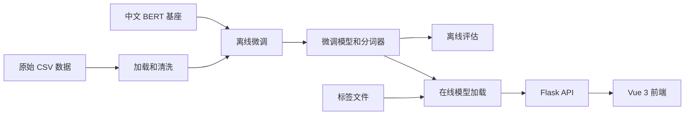

# 外卖评价情感分析

基于中文 BERT 的外卖评价二分类项目。服务端提供 Flask 推理接口，前端使用 Vue 3 构建可视化分析页面，可识别评价为「好评」或「差评」，并返回模型置信度。


## 功能

- 使用微调后的 `bert-base-chinese` 对中文外卖评价进行情感分类。
- 支持单条文本、多条文本和 UTF-8 TXT 文件批量推理。
- 返回原始文本、分类标签、置信度与高置信度标记。
- 提供 Vue 3 前端，可筛选、搜索和导出 CSV 分析结果。
- 前端按窗口高度自适应：常见桌面和移动端尺寸下主要操作在一屏内展示，长结果在面板内滚动。
- 提供训练与评估流水线入口。

## 项目结构

```text
.
├── app/                     # Flask 应用、配置和推理接口
├── common/                  # 训练与推理共用的文本清洗逻辑
├── data/
│   ├── raw/                 # 训练、验证和测试 CSV 数据
│   └── pre/                 # 预处理后的数据输出目录
├── frontend/                # Vue 3 + Vite 前端
├── model/                   # 本地 BERT 基座、微调模型和标签文件（已忽略）
├── training/                # 训练、数据集和评估代码
├── run_pipeline.py          # 离线训练与评估入口
├── requirements.txt         # Python 通用依赖
└── wsgi.py                  # Flask 服务入口
```

## 工作原理

项目分为两个彼此衔接的阶段：离线训练负责将标注评价微调为可部署模型；在线推理负责加载该模型并通过 API 与前端提供预测结果。



图中前五个节点是离线训练流程；从「在线模型加载」开始是在线推理流程。实际文件路径和调用关系见下表。

### 文件夹与文件职责

| 位置 | 职责 | 与其他模块的关系 |
| --- | --- | --- |
| `data/raw/` | 保存训练、验证、测试 CSV。每行是 `数值标签,评价文本`。 | 被 `training/dataset.py` 和 `training/model_eval.py` 读取。 |
| `data/pre/` | 预处理数据的预留输出目录。 | 当前 `run_pipeline.py` 标记数据准备为待补充，训练实际直接读取 `data/raw/`。 |
| `common/preprocess.py` | 清理 HTML、表情和不可见字符，标准化文本。 | 离线训练、评估和在线推理共用，保证三者的输入规则一致。 |
| `training/` | 离线训练域：配置、数据集、训练和评估。 | 读取原始数据和 BERT 基座，生成 `model/ft_bert_dir`。 |
| `model/google-bert/bert-base-chinese/` | 中文 BERT 的预训练基座与原始分词器。 | 仅在离线训练时由 `model_train.py` 加载。 |
| `model/ft_bert_dir/` | 微调完成后的分类模型与分词器。 | 训练写入；评估和 Flask 服务读取。 |
| `model/thy_labels.txt` | 类别编号到中文标签的映射，每行一个标签。 | 在线推理将模型输出的类别索引转为 `好评`、`差评` 等文本。文件顺序必须与训练标签编号一致。 |
| `app/` | Flask 应用工厂、运行配置、模型生命周期和 API。 | 加载 `model/ft_bert_dir`，向 `frontend/` 提供 HTTP 接口。 |
| `frontend/` | Vue 3 + Vite 单页前端。 | 开发期将 `/api` 代理到 Flask；把用户文本或文件提交到 `app/prediction.py`。 |
| `run_pipeline.py` | 离线流水线入口。 | 顺序调用训练和评估。 |
| `wsgi.py` | 在线服务入口。 | 创建 Flask 应用并默认在 `127.0.0.1:8000` 监听。 |

### 离线训练实现

1. `run_pipeline.py` 调用 `training.model_train.train()`。
2. `training/dataset.py` 从 `data/raw/train.csv` 读取样本；`load_corpus()` 使用 `common.preprocess.clean_text_for_bert()` 清洗每一行，再拆分数值标签与评价文本。
3. `WaimaiDataset` 使用 BERT 分词器编码文本，统一截断或填充为 32 个 token，并返回 `input_ids`、`attention_mask` 与标签张量。
4. `training/model_train.py` 加载 `model/google-bert/bert-base-chinese`，创建两个类别的序列分类模型。训练时优先使用 CUDA；嵌入层和前 3 个编码层被冻结，优化器更新第 7 层至最后一层及分类器。
5. 训练完成后，模型权重和分词器通过 `save_pretrained()` 写入 `model/ft_bert_dir`。
6. `run_pipeline.py` 随后调用 `training.model_eval.evaluate()`：它从 `data/raw/test.csv` 随机抽取样本，以相同的清洗和长度规则推理，输出平均准确率与单批耗时。

验证集路径已在 `training/config.py` 中定义；当前训练函数尚未在每个 epoch 中使用验证集进行早停或模型选择。`run_pipeline.py` 的数据准备、模型压缩及压缩后评估步骤目前是预留的待实现项。

### 在线推理实现

1. 运行 `python wsgi.py` 后，`app.create_app()` 加载配置，注册 `/api/v1` 蓝图，并调用 `TextClassifierExtension.warmup()`。
2. `app/extensions.py` 以单例方式加载微调模型、分词器和标签文件。模型根据可用环境放到 CUDA 或 CPU，并切换到 `eval()` 模式；同一进程中后续请求复用已加载的对象。
3. `POST /api/v1/classify` 接受 `text` 字符串或字符串数组；`POST /api/v1/classify_from_file` 接受表单字段 `text_file`，按 UTF-8 读取后逐行处理。
4. 两条接口都复用 `app/prediction.py` 中的 `texts_process_predict()`：先调用共享清洗函数，再以 32 个 token 编码；随后使用 `torch.inference_mode()` 前向计算和 softmax。
5. 最高概率类别会按照 `thy_labels.txt` 转换为标签，接口返回原始文本、标签、百分比置信度和 `is_certain`。置信度达到 80% 时 `is_certain` 为 `true`。
6. Vue 3 前端调用这些接口并展示结果。前端的连接检查会读取 `/` 和 `/labels`；文本、文件、筛选和 CSV 导出逻辑分别位于 `frontend/src` 的组件和组合式函数中。

## 环境要求

- Python 3.12 或兼容版本
- Node.js 20.19+ 或 22.12+
- 可选：CUDA 环境与兼容的 PyTorch，用于 GPU 推理或训练

后端代码还依赖 PyTorch 和 Transformers，但它们当前不在 `requirements.txt` 中。建议先根据 [PyTorch 官方安装页](https://pytorch.org/get-started/locally/) 按你的 CPU / CUDA 环境安装 PyTorch，再安装项目依赖：

```powershell
python -m venv .venv
.\.venv\Scripts\Activate.ps1
python -m pip install --upgrade pip
python -m pip install torch transformers
python -m pip install -r requirements.txt
```

如果 PowerShell 阻止激活虚拟环境，可在命令提示符中执行 `.venv\Scripts\activate.bat`，或按本机策略处理执行权限。

## 模型文件准备

模型目录不会提交到 Git。启动推理服务前，确保以下文件已准备好：

```text
model/
├── google-bert/bert-base-chinese/  # 原始中文 BERT 模型与分词器
├── ft_bert_dir/                    # 微调后模型与分词器
└── thy_labels.txt                  # 每行一个标签，例如：差评、好评
```

默认配置读取 `model/ft_bert_dir` 和 `model/thy_labels.txt`。也可以通过环境变量覆盖：

```powershell
$env:MODEL_PATH = "D:\models\ft_bert_dir"
$env:CLASS_FILE = "D:\models\thy_labels.txt"
```

## 快速开始

### 1. 启动后端

在项目根目录执行：

```powershell
python wsgi.py
```

服务默认监听 `http://127.0.0.1:8000`。首次启动会加载模型，耗时取决于硬件和模型存储位置。

使用下面的命令确认服务状态：

```powershell
Invoke-RestMethod http://127.0.0.1:8000/api/v1/
```

预期结果：

```json
{
  "code": 200,
  "message": "API v1"
}
```

### 2. 启动前端

另开一个终端：

```powershell
cd frontend
npm.cmd ci
npm.cmd run dev
```

访问 <http://127.0.0.1:5173>。

Windows PowerShell 中使用 `npm.cmd` 可以避开 `npm.ps1` 的执行策略限制；其他终端可直接使用 `npm`。前端开发服务器默认将 `/api` 转发到 `http://127.0.0.1:8000`。

如果后端运行在其他地址，将 `frontend/.env.example` 复制为 `frontend/.env.local`，并设置：

```dotenv
API_PROXY_TARGET=http://127.0.0.1:8000
```

修改后重启 Vite。页面右上角的连接设置也可填写完整接口基础地址，例如 `http://127.0.0.1:8000/api/v1`。

## API

接口基础路径为 `/api/v1`。

| 方法 | 路径 | 说明 |
| --- | --- | --- |
| `GET` | `/` | 服务状态 |
| `GET` | `/labels` | 获取标签列表 |
| `POST` | `/classify` | 文本推理 |
| `POST` | `/classify_from_file` | TXT 文件批量推理 |

### 文本推理

```powershell
$body = @{ text = @(
  "粥还是热的，包装很用心，下次还会点。",
  "等了一个多小时才送到，饭菜都凉了。"
) } | ConvertTo-Json -Compress

Invoke-RestMethod `
  -Method Post `
  -Uri http://127.0.0.1:8000/api/v1/classify `
  -ContentType 'application/json' `
  -Body $body
```

单条评价也可以将 `text` 传为字符串。响应示例：

```json
{
  "code": 200,
  "results": [
    {
      "text": "粥还是热的，包装很用心，下次还会点。",
      "label": "好评",
      "confidence": "99.31%",
      "is_certain": true
    }
  ]
}
```

### 文件推理

文件必须为 UTF-8 编码的 `.txt`，每行一条评价：

```powershell
curl.exe -X POST http://127.0.0.1:8000/api/v1/classify_from_file `
  -F "text_file=@reviews.txt;type=text/plain"
```

前端每次限制 500 条评价、2 MB 文件；接口本身未设置同样的服务端批次限制。模型输入最大长度为 32 个 token，较长评价会被截断。

## 训练与评估

原始数据位于 `data/raw`，每行格式为：

```text
标签,评价文本
```

其中标签为数值类别。准备好 `model/google-bert/bert-base-chinese` 后，可运行：

```powershell
python run_pipeline.py
```

流水线将训练模型、保存到 `model/ft_bert_dir`，并使用 `data/raw/test.csv` 做评估。当前训练配置使用 20 个 epoch、批大小 256、4 个 DataLoader 工作进程；请根据显存、CPU 核数和数据规模调整 [training/model_train.py](training/model_train.py) 中的参数。

## 构建前端

```powershell
cd frontend
npm.cmd run build
npm.cmd run preview
```

构建产物位于 `frontend/dist`，本地预览地址为 <http://127.0.0.1:4173>。生产部署时将该目录交给静态服务器，并将 `/api/` 反向代理至 Flask 服务。

## 部署提示

- `wsgi.py` 中的 Flask 开发服务器仅适合本地开发。
- 生产环境建议使用 Waitress 或 Gunicorn，并由 Nginx 处理 TLS 和反向代理。
- 生产环境请设置随机的 `SECRET_KEY`，不要使用默认值。
- 服务会优先使用 CUDA；模型与输入会被放置到同一设备。

## 前端说明

前端实现和更详细的部署说明见 [frontend/README.md](frontend/README.md)。
